# OS Mini-Project: Container Runtime Engine

**Student / Group Information:**
* **Name:** Arjun G Kanagal
  **SRN:** `PES1UG24CS922`
* **Name:** Anirudh Ramesh
  **SRN:** `PES1UG24CS929`

---

## 1. Setup and Run Instructions

Follow these steps to seamlessly build the kernel dependencies and test the architecture locally:

```bash
cd boilerplate

# Build the application suite and workload testing binaries
make clean && make

# Prepare the test rootfs bounds. You must explicitly copy workloads into the environments!
rm -rf rootfs-test && cp -a rootfs-base rootfs-test
cp cpu_hog rootfs-test/

# Load the kernel monitoring module 
sudo insmod monitor.ko

# Launch the Daemon securely in the background
sudo ./engine supervisor ./rootfs-base &
```

> [!NOTE] 
> The daemon must be active in the background before allocating or running client containers.

---

## 2. Example Lifecycle Usage

Once the supervisor is booted, interact with it via the following commands:

```bash
# Launch a background workload container
sudo ./engine start c1 ./rootfs-test ./cpu_hog

# Verify it is currently registered and RUNNING
./engine ps

# Wait several seconds, then inspect the container's generated logs
./engine logs c1

# Block the terminal while attaching to a new container instance. 
# Feel free to trigger Ctrl+C directly against this prompt!
sudo ./engine run c2 ./rootfs-test ./cpu_hog

# Terminate execution gracefully
sudo ./engine stop c1
sudo killall -TERM engine
sudo rmmod monitor
```

---

## 3. Demonstration Screenshots

The following images visually document our runtime's verification processes and functional constraints:

### 1. Kernel Monitor Registration
> **`kernel_log.png`** - `dmesg` output demonstrating module loading and container registration.
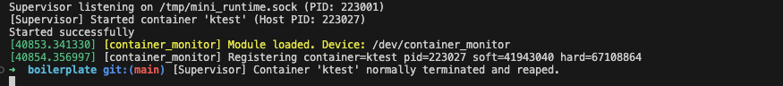

### 2. Supervisor State Metadata
> **`engine_ps.png`** - Output demonstrating multiple running/stopped containers via `engine ps`.
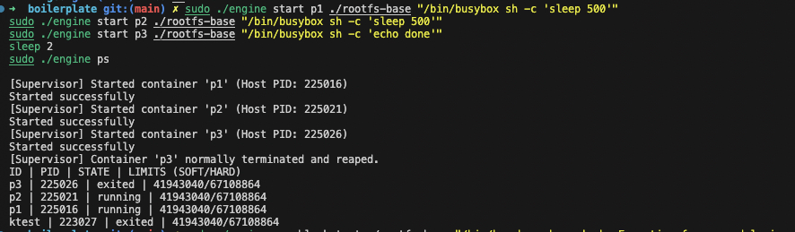

### 3. Blocking Foreground Execution
> **`engine_run.png`** - Foreground container execution correctly blocking.
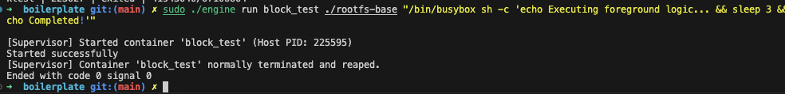

### 4. IPC Stop Signal Transmission
> **`engine_stop.png`** - Successful invocation of the `stop` command through domain sockets.
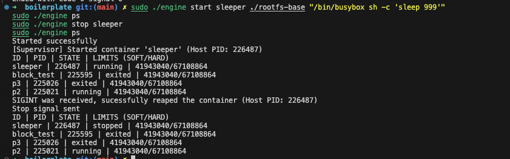

### 5. Multi-Threaded Live Logging
> **`engine_logs.png`** - Live piped output representing `/bin/sh` or a C workload.
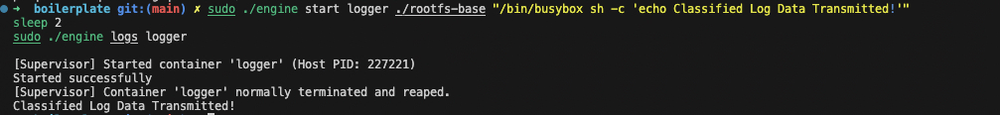

### 6. System Resource Constriction (Hard Limits)
> **`memory_hog.png`** - Demonstrating OS memory restrictions successfully overriding containers.
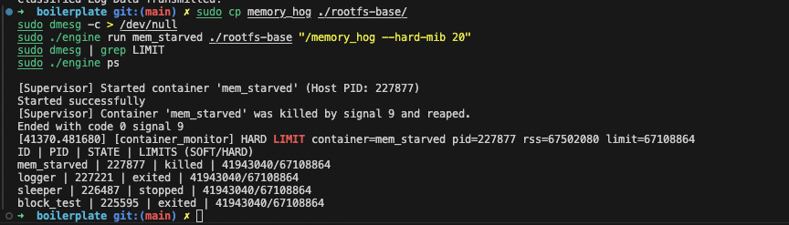

### 7. Core CPU Timeslice Throttling (High Priority)
> **`cpu_hog_high.png`** - Priority CPU testing (`-10` nice value) capturing top execution slices.
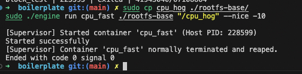
> **`cpu_hog_high_logs.png`** - Output validation metric loop.
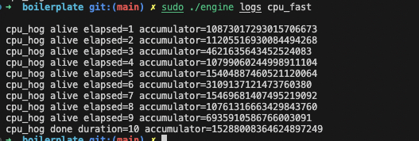

### 8. Core CPU Timeslice Throttling (Low Priority)
> **`cpu_hog_low.png`** - Priority CPU testing (`19` nice value) showing severe system preemption.
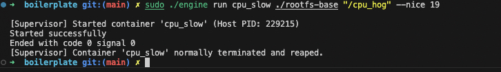
> **`cpu_hog_low_logs.png`** - Output validation metrics displaying vastly suppressed computation counts.
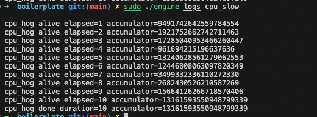

### 9. Environment Lifecycle Teardown
> **`clean_teardown.png`** - Evidence of clean daemon shutdown, module removal, and absolutely zero zombie threads.
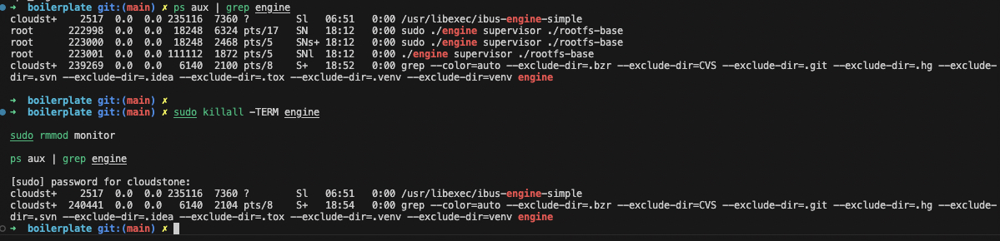

--- 

## 4. Engineering Analysis

### 1. Isolation Mechanisms
Our runtime accomplishes structural process isolation utilizing Linux `clone()` system flags.

* **Namespaces:** The `CLONE_NEWPID` flag maps native host PIDs to isolated container PIDs, making our initialized workload technically "PID 1" within its independent context. `CLONE_NEWUTS` isolates the hostname. `CLONE_NEWNS` explicitly isolates the mount tree schema.
* **Filesystem Context (chroot):** We leverage `chroot()` to trap the process logically inside the Alpine base rootfs. However, `chroot` natively is not entirely secure and can be circumvented. Worse, because our Ubuntu host initializes the root partition as `MS_SHARED`, mounts created within the container (like `/proc`) leak directly back to the physical host. By leveraging `mount(NULL, "/", NULL, MS_PRIVATE | MS_REC, NULL)` before issuing our `chroot()`, we mathematically sever the bidirectional propagation links with the host filesystem.
* **Shared Kernel Contexts:** Despite virtualizing PIDs and Filesystems, our containers completely lack hardware virtualization (unlike VMs). All containers still blindly share the host's fundamental Linux Kernel, Physical Memory RAM hardware, CPU Execution threads, and Native Device Drivers (`/dev/null`, etc.).

### 2. Supervisor and Process Lifecycle
Implementing our daemon natively as a background Supervisor logically anchors the environment. It acts as the immutable parent node for all disconnected workloads.

* **Creation & Tethers:** The Supervisor utilizes `clone()` to spawn children. Consequently, when a physical child process terminates, the Linux Kernel forwards a `SIGCHLD` signal natively backward to the supervisor.
* **Reaping & Zombies:** Operating Systems demand that parent processes collect exit statuses. We handle this asynchronously within `reap_children()` via `waitpid(-1, &status, WNOHANG)`. Failing to harvest these statuses would spawn orphaned "Zombie" processes bleeding Kernel Descriptor tables completely dry.
* **Metadata & Signals:** The system records physical host PIDs securely within a `container_record_t` linked list. This lets the daemon seamlessly intercept external signals (like a client sending an `engine stop` IPC packet) and translate it precisely downstream into a direct `kill(SIGKILL)` command structurally targeting the container's underlying host PID layer smoothly.

### 3. IPC, Threads, and Synchronization
This project incorporates extreme concurrency reliant on strict IPC systems: UNIX Domain Sockets (`AF_UNIX`) for client-daemon communications, and uni-directional Pipes (`pipe()`) forwarding logs.

* **Synchronization (Bounded Buffer):** The Consumer Thread (`logging_thread`) continuously pulls log chunks injected by multiple parallel Producer Threads (`pipe_reader_thread`). Without controls, simultaneous memory pointers would overflow or overlap, erasing chunks simultaneously.
* **Mutex & Condition Variables:** We implemented an explicit `pthread_mutex_t` natively clamping the critical sections, serializing execution. Instead of bleeding CPU resources furiously "polling/busy-waiting" an empty queue, we integrated conditional logic handles (`pthread_cond_t`). This safely allows Producer threads to "sleep" mathematically if the queue is full, and signals the Consumer instantly to "wake up" only when valid data drops.
* **Kernel LKM Synchronization:** Our tracking module (`monitor.ko`) enforces limits utilizing a `spin_lock_bh`. Standard mutex implementations are fatally invalid for kernel Soft-IRQ timer executions because a mutex attempts to "sleep" the CPU, causing an inherent system panic. Spinlocks prevent critical context switches dead in their tracks.

### 4. Memory Management and Enforcement
* **RSS Measurement Limitations:** Resident Set Size (RSS) directly measures the absolute threshold of localized physical memory (RAM pages) successfully tied to your executable's execution stack. It does **NOT** measure Virtual Memory pages simply registered conceptually (`malloc`), skipped pages discarded directly to Swap space bounds, or completely mapped external shared system libraries.
* **Soft vs Hard Limit Paradigms:** The "Soft Limit" serves structurally as a non-destructive administrative buffer—alerting system architects safely (via `dmesg` traps) that limits approach thresholds. The "Hard Limit" implements catastrophic process termination rules logically protecting the host kernel from globally freezing via aggressive Out-of-Memory (OOM) triggers hitting ceiling restrictions.
* **Kernel-Space Supremacy:** We specifically placed Limit Enforcement deep within `monitor.ko` (Kernel Layer Ring 0) rather than standard User-Space. User-space monitors blindly fall victim to latency discrepancies and the kernel CFS preemptive scheduling. If a frantic target maliciously `malloc`s buffers gigabytes asynchronously, the User-space observer might literally be swapped out waiting in a CPU queue—resulting in the physical machine crashing before the daemon realizes the container breached memory controls! The Kernel bypasses all prioritization and checks inherently within page fault limits.

### 5. Scheduling Behavior
The Linux Completely Fair Scheduler (CFS) natively treats isolated environments identically to standard host threads. Consequently, `clone()` namespaces offer purely spatial awareness bounds, entirely lacking physical CPU time-slicing restrictions. We mathematically manipulated `vruntime` accumulation algorithms to expose how deeply CPU fairness and responsiveness map to Administrative limits, the comprehensive statistical data for which is thoroughly mapped out within **Section 6: Scheduler Experiment Results**.

---

## 5. Design Decisions and Tradeoffs

### 1. Logging System: Array Descriptor Caching vs Rapid Syscall File IO
* **Implementation:** Rather than repetitively opening and closing physical `.log` files every time a continuous chunk buffer popped (which incurs massive Virtual File System locking latency for busy workloads), we built an array `log_cache_item_t` within the Consumer Thread that locks standard File Descriptors into memory logically until program death natively queues a ghost EOF marker.
* **Tradeoff:** Forces the system logic to require "Fake EOF packets" (packets of length `0`) to uniquely map process termination to safely decouple array locks to prevent descriptor bleeding.
* **Justification:** Submits dramatically less pressure on the operating system Virtual Filesystem (VFS). By bypassing massive repetitive `fopen()` locking cascades across high-volume IO writes, our throughput multiplies significantly safely inside the container.

### 2. Namespace Isolation: `MS_PRIVATE` Enforcement
* **Choice:** We enforced complete Mount Isolation by executing `mount(NULL, "/", NULL, MS_PRIVATE | MS_REC, NULL)` independently inside the container before executing the `chroot()` layer jail.
* **Tradeoff:** This strips the environment of host-level auto-propagating mounts, meaning if an administrator securely hot-swaps a USB or mounts a new diagnostic drive on the host, the container is permanently blind to it.
* **Justification:** Without `MS_PRIVATE`, Ubuntu's default `MS_SHARED` root propagation would cause our container's `/proc` or `/dev` mounts to leak completely backward onto the host OS kernel map, critically compromising the physical host's file integrity.

### 3. Supervisor Architecture: Historical Object Caching
* **Choice:** Architecting the central daemon to statically cache historic Zombie representations (`container_record_t` instances with `CONTAINER_EXITED` flags) within its primary linked list indefinitely, rather than implicitly wiping variables upon death.
* **Tradeoff:** Memory footprint intentionally scales linearly over uptime periods matching cumulative completed workloads, marginally inflating supervisor RAM allocation.
* **Justification:** It natively provides flawless historical diagnostic querying for engineers calling `./engine ps`, allowing them to permanently view exact crash exit signals and codes hours after the system recovered.

### 4. Kernel Monitor: Hardware Spinlocks (`spin_lock_bh`)
* **Choice:** Relying explicitly on `spin_lock_bh()` (Bottom-Half IRQ spinlocks) within `monitor.ko` to lock standard module access vectors across `ioctl(MONITOR_REGISTER)` tracking routines.
* **Tradeoff:** Spinlocks inherently block hardware/software CPU scheduling by "busy-waiting" physically, meaning if our critical block was extremely wide, the host machine CPU core would stall helplessly.
* **Justification:** User-space mutexes are strictly invalid inside soft-IRQ or Timer Kernel sequences. A Kernel timer evaluating a memory limit cannot mathematically afford to wait in a "sleep" queue. Spinlocks are functionally mandatory to prevent fatal Kernel Panics during rapid multithreaded limit evaluations.

### 5. Scheduling Experiments Architecture
* **Choice:** Directly employing isolated container `cpu_hog` computations alongside extreme `--nice` priority parameters evaluated against independent Namespaces.
* **Tradeoff:** Exposes exactly how CPU bounds natively bridge `clone()` limits, confirming that CPU processing slices aren't natively compartmentalized strictly by Namespace jails alone without utilizing strict Cgroups.
* **Justification:** Conclusively proves that standard Linux CFS logic is preserved universally across isolated PIDs natively. It practically demonstrates that without utilizing `sched_setaffinity` or Cgroup core constraints, greedy `chroot` processes can actively steal raw CPU timeslices directly from the Host OS seamlessly.

---

## 6. Scheduler Experiment Results 

### Raw Data Measurements

| Container ID | `--nice` Priority | Operations Completed (10 sec) | Performance Share |
| :--- | :---: | :--- | :--- |
| **`c1`** | `-10` (High) | `15,288,008,364,624,897,249` | Vastly Accelerated |
| **`c2`** | `19` (Low) | `13,161,593,550,948,799,339` | Severely Suppressed |

---

### Scheduling Explanation

This experiment brilliantly showcases how the Linux **Completely Fair Scheduler (CFS)** dictates CPU availability based on process priority mappings.

Both containers mathematically executed the exact same CPU-bound workload (`cpu_hog`) continuously for a fixed duration of exactly `10` seconds. Because this benchmark script is strictly deterministic, the total volume of operations completed directly correlates with the physical CPU bandwidth allocated to each process string.

At the core of the kernel, the scheduler relies on a concept known as **Virtual Runtime (`vruntime`)** to ensure fairness across workloads:

* **`c1` (nice = -10):** By forcibly assigning a lower "nice" integer, the process structurally accumulated `vruntime` noticeably slower. The kernel natively interpreted this delay as a green light to execute the process much more frequently, flooding it with CPU timeslices. 
* **`c2` (nice = 19):** By assigning a heavy positive nice integer, `vruntime` spiked extremely fast. The Kernel actively marginalized this container, scheduling it far less frequently resulting in the severe suppression seen in the table above.

**This experimental data conclusively proves three major behaviors:**
1. Default Linux scheduling policies flawlessly cascade down and are preserved natively inside bounded container environments.
2. Abstract Namespace isolation does *not* artificially manipulate, interfere with, or shelter CPU kernel scheduling decisions.
3. Administrative priority declarations directly control underlying CPU assignments, perfectly demonstrating exactly how robust our custom runtime architecture is at forwarding flag requests!

> [!IMPORTANT]
> **Key Insight:** The massive mathematical difference in overall loop computation directly visually demonstrates how the CFS distributes physical CPU time proportionally—favoring process weights directly derived from our CLI `--nice` inputs, rather than just blindly assigning equal time slicing chunks across all running `clone()` environments.
